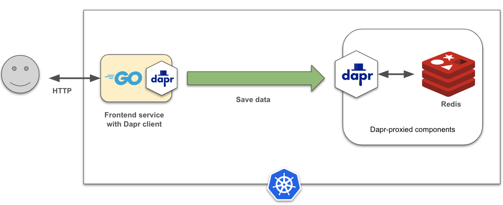

## Simple service with state management
This example shows how to create a simple service (`frontendsvc`) that exposes an HTTP endpoint to post JSON data. Then, the posted data is saved into a Dapr-managed state store component backed by an in-cluster Redis key/value data store.



### Configuration

The configuration for this service includes:
* A Kubernetes [deployment](./manifest/frontend.yaml) manifest 
* A Dapr component for a [Redis data store](./manifest/redis-store.yaml).


### The Go HTTP service

The service is written in Go and it implements a simple HTTP endpoint using the `net/http` package from the standard library. 


```go
package main

var (
	appPort    = os.Getenv("APP_PORT")
	stateStore = "orders-store"
)


func main() {
	if appPort == "" {
		appPort = "8080"
	}
	log.Printf("frontend: starting service: port %s", appPort)

	mux := http.NewServeMux()
	mux.HandleFunc("POST /orders/new", postOrder)

	if err := http.ListenAndServe(":"+appPort, mux); err != nil {
		log.Fatalf("frontend: %s", err)
	}
}
```


#### The HTTP handler

In this example, the HTTP handler does the followings:

* Receives and decode the JSON-encoded into a value of type `Order`
* Generate and assign an order ID
* Update the order's `Completed` field
* Create a `dapr.Client` and use it to store order into the configured Redis data store

The following code snippet shows how that works:

```go
type Order struct {
	ID        string
	Items     []string
	Completed bool
}
...
func postOrder(w http.ResponseWriter, r *http.Request) {
	daprClient, err := dapr.NewClient()
	...
	defer daprClient.Close()

	var receivedOrder Order
	json.NewDecoder(r.Body).Decode(&receivedOrder)
	orderID := fmt.Sprintf("order-%x", rand.Int31())
	receivedOrder.ID = orderID
	receivedOrder.Completed = true
	log.Printf("order received: [orderid=%s]", orderID)

	// save data as JSON
	orderData, err := json.Marshal(receivedOrder)
	daprClient.SaveState(context.Background(), stateStore, orderID, orderData, nil)

	w.Header().Set("Content-Type", "application/json")
	fmt.Fprintf(w, `{"order":"%s", "status":"received"}`, orderID)
}

```

### Building the container image with ko
The code can be compiled and packaged as an OCI-compliant image using `ko` (note: update the `--platform` flag to match your environment):

```
ko build --local -B --platform=linux/arm64 ./frontendsvc
```

Next, check to see if the images are in your local repository:

```
docker images

REPOSITORY             TAG              IMAGE ID       CREATED         SIZE
ko.local/frontendsvc   latest           6094bfc88ad3   2 days ago      16.9MB
```

Next, add the built image into your local Kind cluster:

```
kind load docker-image ko.local/frontendsvc:latest --name dapr-cluster
```

### Deploy the service
The next step is to deploy the application to the Kubernetes cluster:

```
kubectl apply -f ./manifest
```

Use the `kubectl` command to verify the deployment:

First, ensure the Dapr components are deployed properly in the cluster:

```
kubectl get components

NAME           AGE
orders-store   72m
```

Ensure services and application is deployed on the cluster:

```
kubectl get deployments -l app=frontendsvc -o wide

NAME          READY   UP-TO-DATE   AVAILABLE   AGE   CONTAINERS    IMAGES                        SELECTOR
frontendsvc   1/1     1            1           75m   frontendsvc   ko.local/frontendsvc:latest   app=frontendsvc
```

Also check that there are 2 containers running in the application pod (one for the app and the other for the Dapr sidecar):

```
kubectl get pods -l app=frontendsvc
NAME                           READY   STATUS    RESTARTS   AGE
frontendsvc-7c6bb8bf87-kpgvk   2/2     Running   0          3m3s
```


### Running the service
To keep the service configuration simple, we're going to use the Kubernetes port forwarding to access the HTTP endpoint of the service.

```
kubectl port-forward deployment/frontendsvc 8080

Forwarding from 127.0.0.1:8080 -> 8080
Forwarding from [::1]:8080 -> 8080
```

Next, use `curl` to post an order to the frontendsvc endpoint:

```
curl -i -d '{ "items": ["automobile"]}'  -H "Content-type: application/json" "http://localhost:8080/orders/new"
HTTP/1.1 200 OK
Content-Type: application/json
Date: Thu, 04 Apr 2024 00:54:21 GMT
Content-Length: 47

{"order":"order-4d3d076e", "status":"received"}
```

The result is a JSON payload showing the status of the order: 

Next, we can use endpoint `http://localhost:8080/orders/order/{id}` to retrieve the order from the backend state store:

```
curl -i  -H "Content-type: application/json" "http://localhost:8080/orders/order/order-4d3d076e"
HTTP/1.1 200 OK
Content-Type: application/json
Date: Thu, 04 Apr 2024 00:55:45 GMT
Content-Length: 63

{"ID":"order-4d3d076e","Items":["automobile"],"Completed":true
```