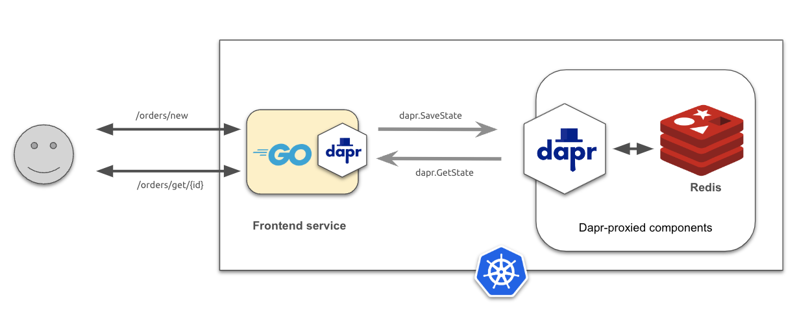

## Saving application state

This example demonstrates how to build stateful applications using the [State Management](https://docs.dapr.io/developing-applications/building-blocks/state-management/) feature of Dapr to store application data in a key/value data store. 

### The Go application

The Go application exposes two endpoints:
* `/orders/new` - to create a new order
* /orders/get/{id} - to retrieve order information

The Go source code makes use of the Dapr API to seamlessly connect to a configured key/value store, (in this case Redis) deployed in the cluster, to store and retrieve application data.




### The source code

The code is simple and uses `net/http` package to create a simple HTTP-based application that accepts HTTP requests at two endpoints. Let's see how that works.

First, let's define some variables and types:

```go
var (
	appPort    = os.Getenv("APP_PORT") // application port
	stateStore = "orders-store"        // Dapr ID for the configured data store
	daprClient dapr.Client
)

// Order type to store incoming order
type Order struct {
	ID        string
	Items     []string
	Completed bool
}
```

The following code snippet defines the HTTP endpoints and starts the server:

```go
func main() {
	if appPort == "" {
		appPort = "8080"
	}

	dc, err := dapr.NewClient()
	...
	daprClient = dc
	defer daprClient.Close()

	mux := http.NewServeMux()
	mux.HandleFunc("POST /orders/new", postOrder)
	mux.HandleFunc("GET /orders/order/{id}", getOrder)

	if err := http.ListenAndServe(":"+appPort, mux); err != nil {
		log.Fatalf("frontend: %s", err)
	}
```

Lastly, the followings defines the HTTP handlers referenced earlier. 

The first snippets implements a handler for endpoint `/order/new` to handle order HTTP post requests:

```go
func postOrder(w http.ResponseWriter, r *http.Request) {
	var receivedOrder Order
	if err := json.NewDecoder(r.Body).Decode(&receivedOrder); err != nil {
		http.Error(w, "unable to post order", http.StatusInternalServerError)
		return
	}

	orderID := fmt.Sprintf("order-%x", rand.Int31())
	receivedOrder.ID = orderID
	receivedOrder.Completed = true

	// marshal order for downstream processing
	orderData, err := json.Marshal(receivedOrder)
	if err != nil {
		http.Error(w, "unable to post order", http.StatusInternalServerError)
		return
	}

	// Use Dapr state management API to save application state
	// Use the orderId as key to save value as JSON-encoded binary
	if err := daprClient.SaveState(r.Context(), stateStore, orderID, orderData, nil); err != nil {
		http.Error(w, "unable to post order", http.StatusInternalServerError)
		return
	}

	w.Header().Set("Content-Type", "application/json")
	fmt.Fprintf(w, `{"order":"%s", "status":"received"}`, orderID)
}
```

The next snippet defines a HTTP handler for endpoint `/orders/get/{id}` to retrieve order data:

```go
func getOrder(w http.ResponseWriter, r *http.Request) {
	id := r.PathValue("id")

	// Use Dapr state management API to retrieve order by key
	data, err := daprClient.GetState(r.Context(), stateStore, id, nil)
	if err != nil {
		log.Printf("get order data: %s", err)
		http.Error(w, "unable to get order", http.StatusInternalServerError)
		return
	}

	w.Header().Set("Content-Type", "application/json")
	fmt.Fprint(w, string(data.Value))
}
```


### Building the container image with ko
The code can be compiled and packaged as an OCI-compliant image using `ko` (note: update the `--platform` flag to match your environment):

```
ko build --local -B --platform=linux/arm64 ./frontendsvc
```

Next, check to see if the images are in your local repository:

```
docker images

REPOSITORY             TAG              IMAGE ID       CREATED         SIZE
ko.local/frontendsvc   latest           6094bfc88ad3   2 days ago      16.9MB
```

Next, add the built image into your local Kind cluster:

```
kind load docker-image ko.local/frontendsvc:latest --name dapr-cluster
```
### Kubernetes configuration

The configurations to run this example you will need:
* A Kubernetes [Deployment](./manifest/frontend.yaml) manifest 
* A Dapr component for a [Redis data store](./manifest/redis-store.yaml).

Because the code invokes the Dapr API, the application must be deployed along with the Dapr sidecar at runtime. You can read more about running Dapr-enabled applications on Kubernetes [here](https://docs.dapr.io/operations/hosting/kubernetes/).

To enable the Dapr sidecar during deployment, you need to annotate your Kubernetes `Deployment` appropriately with Dapr metadata as shown in the following snippet:

```yaml
kind: Deployment
metadata:
  name: frontendsvc
spec:
...
  template:
    metadata:
      labels:
        app: frontendsvc
      annotations:
        dapr.io/enabled: "true"
        dapr.io/app-id:  "frontendsvc"
```

You can see a full list of Dapr annotations [here](https://docs.dapr.io/reference/arguments-annotations-overview/).

### Deploy the application
The next step is to deploy the application to the Kubernetes cluster:

```
kubectl apply -f ./manifest
```

Use the `kubectl` command to verify the deployment:

First, ensure the Dapr components are deployed properly in the cluster:

```
kubectl get components

NAME           AGE
orders-store   72m
```

We see component `order-store` is deployed with no problem.

Next, ensure the application pod is deployed in the cluster:

```
kubectl get deployments -l app=frontendsvc -o wide

NAME          READY   UP-TO-DATE   AVAILABLE   AGE   CONTAINERS    IMAGES                        SELECTOR
frontendsvc   1/1     1            1           75m   frontendsvc   ko.local/frontendsvc:latest   app=frontendsvc
```

Also check that there are 2 containers running in the application pod (one for the app and the other for the Dapr sidecar):

```
kubectl get pods -l app=frontendsvc
NAME                           READY   STATUS    RESTARTS   AGE
frontendsvc-7c6bb8bf87-kpgvk   2/2     Running   0          3m3s
```

### Running the application
To keep the application's configuration simple, we're going to use the Kubernetes port forwarding to access its HTTP endpoints:

```
kubectl port-forward deployment/frontendsvc 8080

Forwarding from 127.0.0.1:8080 -> 8080
Forwarding from [::1]:8080 -> 8080
```

Next, let's use `curl` to post an order to the `frontendsvc` endpoint:

```bash
curl -i -d '{ "items": ["automobile"]}'  -H "Content-type: application/json" "http://localhost:8080/orders/new"

HTTP/1.1 200 OK
Content-Type: application/json
Date: Thu, 04 Apr 2024 00:54:21 GMT
Content-Length: 47
```

The result is a JSON payload showing the status of the order: 

```json
{"order":"order-4d3d076e", "status":"received"}
```

Next, let's use endpoint `http://localhost:8080/orders/order/{id}` to retrieve the order from the state store:

```
curl -i  -H "Content-type: application/json" "http://localhost:8080/orders/order/order-4d3d076e"

HTTP/1.1 200 OK
Content-Type: application/json
Date: Thu, 04 Apr 2024 00:55:45 GMT
Content-Length: 63
```

The result is JSON-encoded data about the retrieved order:

```json
{"ID":"order-4d3d076e","Items":["automobile"],"Completed":true}
```

### Troubleshooting
If you run into errors or the order is not getting created properly, you can follow these troubleshooting steps to figure out what's going on.

Review the Dapr sidecar container logs for the services

```
kubectl logs -l app=frontend -c daprd
```

Review the logs for the application services

```
kubectl logs -l app=frontend 
```
