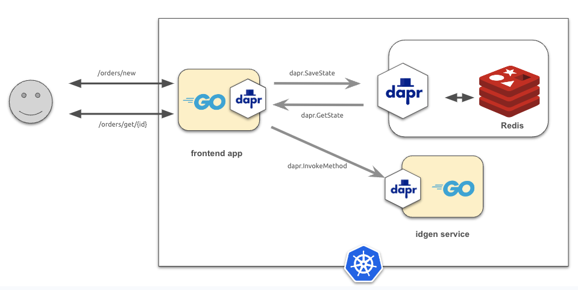

## Invoke Dapr-managed services

This example demonstrates how to create and deploy a Dapr-managed service that can be invoked from the `frontend` application. 

### Pre-requisites
Refer to example [01-state-management](../01-state-management/README.md) for an introduction on how to setup the the `frontend` application.

### The Go application

In the previous [example](../01-state-management/), application `frontend` was setup with two endpoints: 

- One endpoint to save an order 
- The other endpoint to retrieve a saved order

Application `frontend`'s code handles all of the logic necessary to drive the order.

This example, however, extracts the functionality that generates the order ID and places it in a new stand-alone service called `genid`. 
Now, when an order request is received, the frontendsvc application will invoke the `genidsvc` service using the Dapr Service Invocation feature,
to gegnerate a UUID value that can subsequently be used as the order id. 




### The `genid` service source code

The code for this example uses the Dapr API to declare and start a service endpoint. Let's see how that is done below.

First, let's define some variables and types:

```go
var (
	appPort    = os.Getenv("APP_PORT") // service port
)
```

The next code snippet defines and start the service using the Dapr API.:

```go
func main() {
	dapr := daprd.NewService(fmt.Sprintf(":%s", appPort))

	// Define service endpoint /genid
	if err := dapr.AddServiceInvocationHandler("/genid", generateId); err != nil {
		log.Fatalf("genid: invocation handler setup: %v", err)
	}

	// start the service
	if err := dapr.Start(); err != nil && err != http.ErrServerClosed {
		log.Fatalf("genid start: %v", err)
	}
}
```

Lastly, let's define the service handler that generates the ID as a UUID value. 

```go
func generateId(ctx context.Context, in *common.InvocationEvent) (*common.Content, error) {
	id := uuid.New()
	out := &common.Content{
		Data:        []byte(id.String()),
		ContentType: in.ContentType,
		DataTypeURL: in.DataTypeURL,
	}

	return out, nil
}
```

### Update to the `frontendsvc` application

The code in the `frontendsvc` application must be updated to use the `genidsvc` to generate the ID for the order. 

First, let's declare the name of the `genidsvc` service so it can be invoked later.

```go
var (
	genidsvcId = "genidsvc"
	...
)
```

Next, let's update the code in `frontendsvc` to use the Dapr Client API to invoke remote service.
This is done using the `daprClient.InvokeMethod` method call that takes the name/id of the Dapr-registered
service as an argument as shown in the snippet below:

```go
func postOrder(w http.ResponseWriter, r *http.Request) {
	...
	// invoke genidsvc service to generate order UUID
	out, err := daprClient.InvokeMethod(r.Context(), genidsvcId, "genid", "get")
	if err != nil {
		log.Printf("order genid: %s", err)
		http.Error(w, "unable to post order", http.StatusInternalServerError)
		return
	}
	orderID := fmt.Sprintf("order-%s", string(out))
	...
}

```

### Building the containers with `ko`
Nowe we can create OCI-compliant images using `ko` (note: update the `--platform` flag to match your environment):

```
ko build --local -B --platform=linux/arm64 ./frontendsvc
ko build --local -B --platform=linux/arm64 ./genidsvc
```

Next, check to see if the images are in your local repository:

```
docker images

REPOSITORY             TAG              IMAGE ID       CREATED         SIZE
ko.local/frontendsvc   latest           78e50b346643   10 days ago     17.2MB
ko.local/genidsvc      latest           a957b45ffa1d   10 days ago     17.4MB
```

Next, add the latest built image into your local Kind cluster:

```
kind load docker-image ko.local/frontendsvc:latest --name dapr-cluster
kind load docker-image ko.local/genidsvc:latest --name dapr-cluster
```

Lastly, let's ensure the latest images are added to Kind:

```
docker exec -it dapr-cluster-control-plane crictl images

IMAGE                  TAG                  IMAGE ID            SIZE
ko.local/frontendsvc   latest               78e50b346643d       17.7MB
ko.local/genidsvc      latest               a957b45ffa1dc       17.9MB
```
### Kubernetes configuration
In this example, we will have three YAML configurations to deploy:
* A Kubernetes [Deployment](./manifest/frontend.yaml) manifest for `frontendsvc`
* A Kubernetes [Deployment](./manifest/genid.yaml) manifest for `genidsvc`
* A Dapr Component for a [Redis data store](./manifest/redis-store.yaml).

Because application services `frontendsvc` and `genidsvc` use the Dapr API directly, their Kubernetes deployments must include the Dapr sidecar at runtime.

The following shows a snippet for the [`frontendsvc`](./manifest/frontend.yaml) application that includes annotations that will cause the injection of the Dapr runtime sidecar container:

```yaml
kind: Deployment
metadata:
  name: frontendsvc
spec:
...
  template:
    metadata:
      labels:
        app: frontendsvc
      annotations:
        dapr.io/enabled: "true"
        dapr.io/app-id:  "frontendsvc"
```
Similarly, the deployment for the `genidsvc` service includes annotations for its Dapr sidecar.
Note the `dapr.io/app-port: "5050"`: this is to configure the sidecar to be able to reach the `genidsvc` service on its listening port.
The annotation `app-port` value matches the exposed port of the application's  `containerPort value` as shown below.

```yaml
kind: Deployment
metadata:
  name: genidsvc
spec:
...
  template:
    metadata:
      labels:
        app: genidsvc
      annotations:
        dapr.io/enabled: "true"
        dapr.io/app-id:  "genidsvc"
        dapr.io/app-port: "5050"
    spec:
      containers:
        - name: genidsvc
          image: ko.local/genidsvc:latest
          ports:
            - containerPort: 5050
```

You can read more about running Dapr-enabled applications on Kubernetes [here](https://docs.dapr.io/operations/hosting/kubernetes/).

### Deploy the application
The next step is to deploy the application to the Kubernetes cluster:

```
kubectl apply -f ./manifest
```

Use the `kubectl` command to verify the deployment:

First, ensure the Dapr components are deployed properly in the cluster:

```
kubectl get components

NAME           AGE
orders-store   72m
```

We see component `order-store` is deployed with no problem.

Next, ensure the application pod is deployed in the cluster:

```
kubectl get deployments -l app=frontendsvc -o wide

NAME          READY   UP-TO-DATE   AVAILABLE   AGE   CONTAINERS    IMAGES                        SELECTOR
frontendsvc   1/1     1            1           75m   frontendsvc   ko.local/frontendsvc:latest   app=frontendsvc

kubectl get deployments -l app=genidsvc -o wide
NAME       READY   UP-TO-DATE   AVAILABLE   AGE   CONTAINERS   IMAGES                     SELECTOR
genidsvc   1/1     1            1           46s   genidsvc     ko.local/genidsvc:latest   app=genidsvc
```

Lastly, let's check that there are 2 containers running in the deployed application pods (one for the app and the other for the Dapr sidecar):

```
kubectl get pods -l app=frontendsvc
NAME                           READY   STATUS    RESTARTS   AGE
frontendsvc-7c6bb8bf87-kpgvk   2/2     Running   0          3m3s

kubectl get pods -l app=genidsvc
NAME                       READY   STATUS    RESTARTS   AGE
genidsvc-74b5459ff-mbh6r   2/2     Running   0          2m9
```

### Running the application
To keep the application's configuration simple, we're going to use the Kubernetes port forwarding to access its HTTP endpoints:

```
kubectl port-forward deployment/frontendsvc 8080

Forwarding from 127.0.0.1:8080 -> 8080
Forwarding from [::1]:8080 -> 8080
```

Next, let's use `curl` to post an order to the `frontendsvc` endpoint:

```bash
curl -i -d '{ "items": ["automobile"]}'  -H "Content-type: application/json" "http://localhost:8080/orders/new"

HTTP/1.1 200 OK
Content-Type: application/json
Date: Mon, 08 Apr 2024 13:01:31 GMT
Content-Length: 75
```

The result is a JSON payload showing the status of the order.
Note that the ID for the order has a UUID suffix attached to it now.

```json
{"order":"order-e4e6240e-62a4-496d-9e2f-b20f4f5bab0b", "status":"received"}
```

Next, let's use endpoint `http://localhost:8080/orders/order/{id}` to retrieve the order from the state store:

```
curl -i  -H "Content-type: application/json" "http://localhost:8080/orders/order/order-e4e6240e-62a4-496d-9e2f-b20f4f5bab0b"

HTTP/1.1 200 OK
Content-Type: application/json
Date: Mon, 08 Apr 2024 13:16:46 GMT
Content-Length: 91
```

The result is a JSON-encoded data for the order:

```json
{"ID":"order-e4e6240e-62a4-496d-9e2f-b20f4f5bab0b","Items":["automobile"],"Completed":true}
```

### Troubleshooting
If you run into errors or the order is not getting created properly, you can follow these troubleshooting steps to figure out what's going on.

Review the Dapr sidecar container logs for the services

```
kubectl logs -l app=frontend -c daprd
kubectl logs -l app=genidsvc -c daprd
```

Review the logs for the application services

```
kubectl logs -l app=frontend 
kubectl logs -l app=genidsvc
```
