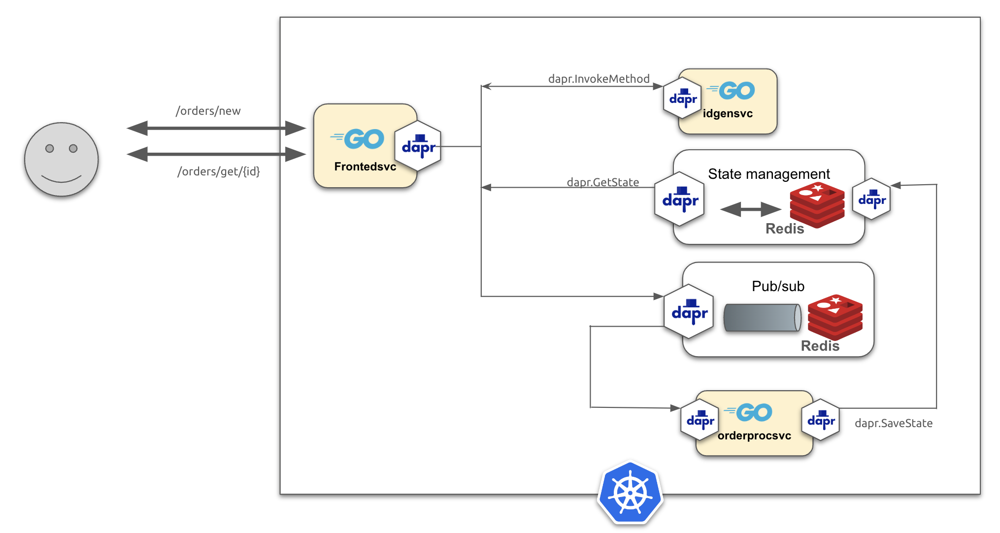

## Dapr Publish/Subscribe

This example demonstrates how to create a Dapr application that can handle message events using a publish/subscribe component. 

### Pre-requisites
* Refer to example [01-state-management](../01-state-management/README.md) for an introduction on how to setup the the `frontend` application.

* Review example [02-invoke-service](../02-invoke-service/) to see how the application uses Dapr's service invocation to generate order IDs.


### The Go application
This example modifies application `frontend` to delegate the process of creating/saving orders in the following ways:
- The example introduces a Redis-back pub/sub component
- When a new order comes in, the application invokes `genidsvc` to generate the order ID
- The application saves (in Redis store) the new order 
- The orderID is then published to an event topic (`orders-received`) backed by Redis
- The new [`orderprocsvc`](./orderprocsvc/) service (this example) subscribes to the topic 
- When an orderID is received, the service retrieves the order, updates it, and saves it back in the Redis store

This sequence is illustrated in the figure below.




### The `orderprocsvc` service source code

The code introduced in this example uses the Dapr API to declare and start a service with a topic event handler to receive incoming order IDs published by the `frontend` service. The code also creates a Dapr client that is used to save the updated state of the order in the Redis store.

Let's see how that is done below.

First, let's define some variables and types:

```go
var (
	daprClient dapr.Client
	appPort    = os.Getenv("APP_PORT")
	pubsub     = os.Getenv("ORDERS_PUBSUB")
	topic      = os.Getenv("ORDERS_PUBSUB_TOPIC")
)
```

The next code snippet defines a subscription to the topic with order events. The code also sets up a service and registers the handler that will be triggered when an event arrives on the specified topic.

```go
func main() {
	// define subscription
	rcvdSub := &common.Subscription{
		PubsubName: pubsub,
		Topic:      topic,
		Route:      topic,
	}

	// Create service
	s := daprd.NewService(fmt.Sprintf(":%s", appPort))
	if err := s.AddTopicEventHandler(rcvdSub, subHandler); err != nil {
		log.Fatalf("orderproc: topic subscription: %v", err)
	}
}
```

Lastly, let's define the service handler that generates the ID as a UUID value. 

```go
func generateId(ctx context.Context, in *common.InvocationEvent) (*common.Content, error) {
	id := uuid.New()
	out := &common.Content{
		Data:        []byte(id.String()),
		ContentType: in.ContentType,
		DataTypeURL: in.DataTypeURL,
	}

	return out, nil
}
```

### Update to the `frontendsvc` application

The code in the `frontendsvc` application must be updated to use the `genidsvc` to generate the ID for the order. 

First, let's declare the name of the `genidsvc` service so it can be invoked later.

```go
var (
	genidsvcId = "genidsvc"
	...
)
```

Next, let's update the code in `frontendsvc` to use the Dapr Client API to invoke remote service.
This is done using the `daprClient.InvokeMethod` method call that takes the name/id of the Dapr-registered
service as an argument as shown in the snippet below:

```go
func postOrder(w http.ResponseWriter, r *http.Request) {
	...
	// invoke genidsvc service to generate order UUID
	out, err := daprClient.InvokeMethod(r.Context(), genidsvcId, "genid", "get")
	if err != nil {
		log.Printf("order genid: %s", err)
		http.Error(w, "unable to post order", http.StatusInternalServerError)
		return
	}
	orderID := fmt.Sprintf("order-%s", string(out))
	...
}

```

### Building the containers with `ko`
Nowe we can create OCI-compliant images using `ko` (note: update the `--platform` flag to match your environment):

```
ko build --local -B --platform=linux/arm64 ./frontendsvc
ko build --local -B --platform=linux/arm64 ./genidsvc
ko build --local -B --platform=linux/arm64 ./orderprocsvc
```

Next, check to see if the images are in your local repository:

```
docker images

REPOSITORY             TAG              IMAGE ID       CREATED         SIZE
ko.local/frontendsvc   latest           78e50b346643   10 days ago     17.2MB
ko.local/genidsvc      latest           a957b45ffa1d   10 days ago     17.4MB
ko.local/orderprocsvc  latest           89f4f84441f7   2 weeks ago     17.4MB

```

Next, add the latest built image into your local Kind cluster:

```
kind load docker-image ko.local/frontendsvc:latest --name dapr-cluster
kind load docker-image ko.local/genidsvc:latest --name dapr-cluster
kind load docker-image ko.local/orderprocsvc:latest --name dapr-cluster
```

Lastly, let's ensure the latest images are added to Kind:

```
docker exec -it dapr-cluster-control-plane crictl images

IMAGE                  TAG                  IMAGE ID            SIZE
ko.local/frontendsvc   latest               78e50b346643d       17.7MB
ko.local/genidsvc      latest               a957b45ffa1dc       17.9MB
ko.local/orderprocsvc  latest               89f4f84441f7f       17.9MB
```
### Kubernetes configuration
In this example, we will use the following YAML configurations:
* A Kubernetes [Deployment](./manifest/frontend.yaml) manifest for `frontendsvc`
* A Kubernetes [Deployment](./manifest/genid.yaml) manifest for `genidsvc`
* A Kubernetes [Deployment](./manifest/orderproc.yaml) manifest for `orderprocsvc`
* A Dapr Component for a [Redis data store](./manifest/redis-store.yaml)
* A Dapr Component for a [Redis pub/sub](./manifest/redis-pubsub.yaml).


Because theh `procordersvc` application service uses the Dapr API directly, its Kubernetes deployments must include the Dapr sidecar as shown in the following snippet:

Manifest [orderproc.yaml](./manifest/orderproc.yaml)
```yaml
kind: Deployment
metadata:
  name: orderprocsvc
spec:
...
  template:
    metadata:
      labels:
        app: orderprocsvc
      annotations:
        dapr.io/enabled: "true"
        dapr.io/app-id:  "orderprocsvc"
        dapr.io/app-port: "5050"
    spec:
      containers:
        - name: orderprocsvc
          image: ko.local/orderprocsvc:latest
          ports:
            - containerPort: 5050
          env:
            - name: APP_PORT
              value: "6060"
            - name: ORDERS_PUBSUB
              value: "orders-pubsub"
            - name: ORDERS_PUBSUB_TOPIC
              value: "received-orders"
```
Notice in the deployment, the environment variables are used to configure the names of the pubsub service and its topic.

### Deploy the application
The next step is to deploy the application to the Kubernetes cluster:

```
kubectl apply -f ./manifest
```

Use the `kubectl` command to verify the deployment:

First, ensure the Dapr components are deployed properly in the cluster:

```
kubectl get components

NAME            AGE
orders-pubsub   20s
orders-store    20s
```

We see components `order-store` and `order-pubsub` are deployed with no problem.

Next, ensure the application pods are deployed in the cluster:

```
kubectl get deployments -l app=frontendsvc -o wide

NAME          READY   UP-TO-DATE   AVAILABLE   AGE   CONTAINERS    IMAGES                        SELECTOR
frontendsvc   1/1     1            1           75m   frontendsvc   ko.local/frontendsvc:latest   app=frontendsvc

kubectl get deployments -l app=genidsvc -o wide
NAME       READY   UP-TO-DATE   AVAILABLE   AGE   CONTAINERS   IMAGES                     SELECTOR
genidsvc   1/1     1            1           46s   genidsvc     ko.local/genidsvc:latest   app=genidsvc

kubectl get deployments -l app=orderprocsvc -o wide
NAME           READY   UP-TO-DATE   AVAILABLE   AGE   CONTAINERS     IMAGES                         SELECTOR
orderprocsvc   1/1     1            1           19m   orderprocsvc   ko.local/orderprocsvc:latest   app=orderprocsvc
```

Lastly, let's check that there are 2 containers running in the deployed application pods (one for the app and the other for the Dapr sidecar):

```
kubectl get pods 
NAME                            READY   STATUS    RESTARTS        AGE
frontendsvc-5dc48f44dc-n4xmj    2/2     Running   7 (111s ago)    20m
genidsvc-5645f6d8d-ppfwt        2/2     Running   4 (2m9s ago)    20m
orderprocsvc-5cbbb96688-4vn4v   2/2     Running   8 (81s ago)     20m
```

### Running the application
To keep the application's configuration simple, we're going to use the Kubernetes port forwarding to access its HTTP endpoints:

```
kubectl port-forward deployment/frontendsvc 8080

Forwarding from 127.0.0.1:8080 -> 8080
Forwarding from [::1]:8080 -> 8080
```

Next, let's use `curl` to post an order to the `frontendsvc` endpoint:

```bash
curl -i -d '{ "items": ["automobile"]}'  -H "Content-type: application/json" "http://localhost:8080/orders/new"

HTTP/1.1 200 OK
Content-Type: application/json
Date: Mon, 08 Apr 2024 13:01:31 GMT
Content-Length: 75
```

The result is a JSON payload showing the status of the order.
Note that the order id has now UUID suffix attached to it now.

```json
{"order":"order-e4e6240e-62a4-496d-9e2f-b20f4f5bab0b", "status":"received"}
```

Next, let's use endpoint `http://localhost:8080/orders/order/{id}` to retrieve the order from the state store:

```
curl -i  -H "Content-type: application/json" "http://localhost:8080/orders/order/order-1a768924-4d85-4e72-94df-98541f26225e"
HTTP/1.1 200 OK
Content-Type: application/json
Date: Sat, 27 Apr 2024 18:47:11 GMT
Content-Length: 108
```

The result is a JSON-encoded data for the order:

```json
{"ID":"order-1a768924-4d85-4e72-94df-98541f26225e","Items":["automobile"],"Received":true,"Completed":true}
```

### Troubleshooting
If you run into errors or the order is not getting created properly, you can follow these troubleshooting steps to figure out what's going on.

Review the Dapr sidecar container logs for the services

```
kubectl logs -l app=frontend -c daprd
kubectl logs -l app=genidsvc -c daprd
kubectl logs -l app=orderprocsvc -c daprd
```

Review the logs for the application services

```
kubectl logs -l app=frontend 
kubectl logs -l app=genidsvc
kubectl logs -l app=orderprocsvc
```
